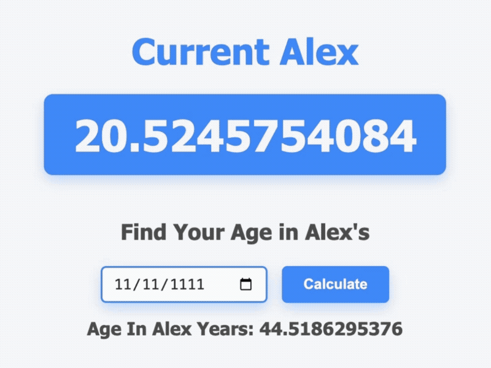

## Hi There, I'm Alex 👋

Third-year undergraduate aerospace MEng student studying at the University of Manchester.  
3D printing enthusiast, general tinkerer & weekend drone flier.  

## Favourite Projects Showcase

  
  

  
  

 

## Dabbled With

 

## GitHub Usage

