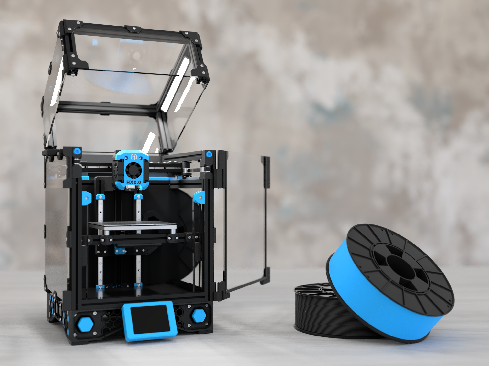

## Hi There, I'm Alex 👋

Third-year undergraduate aerospace MEng student studying at the University of Manchester.  
3D printing enthusiast, general tinkerer & weekend drone flier.  

## Favourite Projects Showcase

  
  

 

## Proficient With
Fusion, Matlab, Solidworks, ESP32, Arduino, Raspberry Pi, Etc.

 

## GitHub Usage

